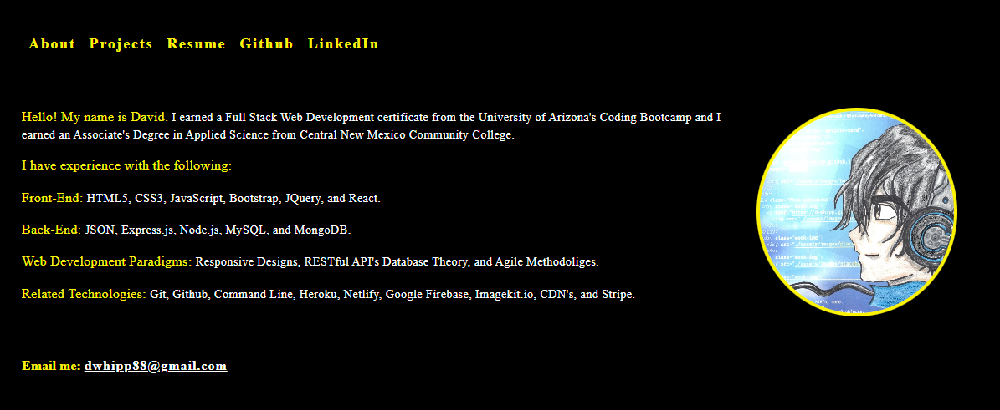

# Portfolio 23

## Front-End SPA Web Application

## Description

This is my UPDATED Portfolio Website for the year 2023. This website houses everything I need to land a job as a Front-End Web Developer.

## Table of Contents

-   [Portfolio 23](#portfolio-23)
    -   [Front-End SPA Web Application](#front-end-spa-web-application)
    -   [Description](#description)
    -   [Table of Contents](#table-of-contents)
    -   [Purpose](#purpose)
    -   [Usage](#usage)
    -   [Technologies](#technologies)
    -   [License](#license)
    -   [About](#about)
    -   [Badges](#badges)

## Purpose

To showcase my work and skills to potential clients or employers.

## Usage

[Portfolio 23](https://splendid-ganache-f82581.netlify.app/) is a Portfolio Website. Click the link and you will be take to my 2023 UPDATED porfolio.  
Once there you can:

-   View my skills
-   View my projects
-   Click links to be taken to my Resume, Github, and LinkedIn

## Technologies

-   HTML5
-   CSS3
-   Sass
-   JSON
-   Javascript
-   React
-   Netlify (Deployment)
-   Imagekit.io (CDN)

## License

MIT License

Copyright (c) [2023] [David Whipple]

Permission is hereby granted, free of charge, to any person obtaining a copy of this software and associated documentation files (the "Software"), to deal in the Software without restriction, including without limitation the rights to use, copy, modify, merge, publish, distribute, sublicense, and/or sell copies of the Software, and to permit persons to whom the Software is furnished to do so, subject to the following conditions:

The above copyright notice and this permission notice shall be included in all copies or substantial portions of the Software.

THE SOFTWARE IS PROVIDED "AS IS", WITHOUT WARRANTY OF ANY KIND, EXPRESS OR IMPLIED, INCLUDING BUT NOT LIMITED TO THE WARRANTIES OF MERCHANTABILITY, FITNESS FOR A PARTICULAR PURPOSE AND NONINFRINGEMENT. IN NO EVENT SHALL THE AUTHORS OR COPYRIGHT HOLDERS BE LIABLE FOR ANY CLAIM, DAMAGES OR OTHER LIABILITY, WHETHER IN AN ACTION OF CONTRACT, TORT OR OTHERWISE, ARISING FROM, OUT OF OR IN CONNECTION WITH THE SOFTWARE OR THE USE OR OTHER DEALINGS IN THE SOFTWARE.

## About

Hello, my name is David  
You can email me at [dwhipp88@gmail.com](mailto:dwhipp88@gmail.com)  
You can view my [github](https://github.com/D-Whipp).  
Check out my [portfolio](https://splendid-ganache-f82581.netlify.app/).  
Let's make a connection! [LinkedIn](https://www.linkedin.com/in/david-w-079841213/)

## Badges

